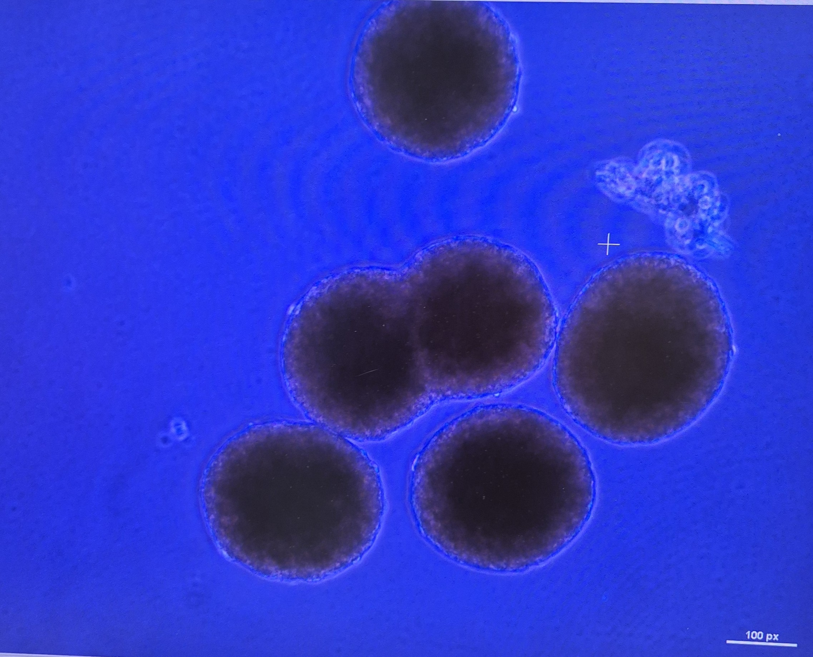

Pancreatic islet cells passage using the extroducer
===
## Objective
The objective of this study was to examine the possibility to passage the pancreatic islet cells and stem cell aggregates through the device
## Setting
**Location:** Huddinge University Hospital, Neo building, Lanner Laboratory  
**Involved** **people:** Jonathan Al-Saadi, Ulrik Birgersson, Eda Erbil (PhD student), Shivam Chandel (Post-Doc)  
**Date:** 2025-11-07  
**Time:** 12:30  

## Previous work
- Shivam and Eda previously tried injecting islets through the device (around 500) but found no islets on the other side. There was no clog. No data recorded or saved.  
- Jonathan have previously passaged HVPs and hMSCs through the device. Data from those experiments show that high flows speeds result in higher _proportion passaged_ while keeping *viability* high

 ## Background
Pancreatic islets are either natural allogen or grown islets that contain a heterogenus group of cells. 

| Cells   | Produce |
| ------- | ------- |
| β-cells | insulin |
| α-cells | glucagon |
| δ-cells        | somatostatin        |

### Why transplant pancreatic islets instead of single cell types?

Pancreatic islets function as a coordinated micro-organ that regulates blood glucose. They contain β-cells (insulin), α-cells (glucagon), and δ-cells (somatostatin), allowing for built-in feedback control. This integrated signaling enables physiological insulin release when glucose is high and glucagon release when glucose is low, reducing the risk of hypoglycemia. In contrast, isolated β-cells or engineered insulin-producing cells lack this regulatory balance and often show less stable function. Therefore, islet transplantation provides more natural, reliable glucose regulation than individual cell transplants.

### Challenges with pancreatic islet transplantation from humans

- **Immune rejection and autoimmunity:** Transplanted islets are targeted by both alloimmune responses and the patient’s underlying type 1 diabetes autoimmunity, requiring lifelong immunosuppression.
- **Loss of islet mass after transplantation:** A large fraction of islets die shortly after infusion due to ischemia, inflammation, and instant blood-mediated inflammatory reaction (IBMIR).
- **Limited donor supply:** High-quality human donor pancreases are scarce, and many patients require islets from more than one donor to achieve insulin independence.
- **Suboptimal engraftment site:** The liver (portal vein) is the standard site but provides poor oxygenation and exposes islets to inflammatory and metabolic stress. It is also not representative of the real arterial blood glucose.

### Potential solution
Growing pancreatic islets will allow for selecting cells without specific markers decreasing the need for immunosuppression and increasing the chance of engraftments and the need for donors.  
Using the extroducer will allow for transplantation of these islets directly to the pancreas which will be more physiological and allow for better and real arterial blood glucose control.  

## Methods
### Islets
Pancreatic islets were cultured according to the protocol described by Lanner et al. A total of 35,000 islets were isolated and expanded, alongside 10,000 stem cell–derived aggregates. Islet size was controlled during culture, with a target diameter of approximately 100 µm. All cultures were maintained under standard humidified incubator conditions (37 °C, 5% CO₂) and routinely monitored for morphology and viability throughout the expansion period.
### Harvest
Islets where harvested by aspiration and then let to sedement in a falcon tube. The supernatant was removed by aspiration and the islets where resuspended in the final carrier solution. For these experiments the carrier solution where:  

- PBS
- PBS + Pyronics 1% and BSA 1% 

### Counting
Counting was performed by sedementing the islets to the middle of a dish and then taking a photo with a camera through a microscope then counting the amount. 

### Injections/Passages  
The islets where aspirated through a metal 21G needle (0.8x40mm) to a plastic syringe, the syringe that comes with the device. Before aspiration the cells were gently resuspended in the carrier solution by pipetting the volume up and down using the syringe. The islets where then passaged with high speeds to a 12 well plates and PBS was added to make couniting easier. The islets where then flushed using the carrier solution and the same volumes. 

## Results  
### Islets  
The pancreatic islets that where grown (in total 35 000) had fused. This resulted in large islets that were larger than expected. Some where in the magnitude of 150 um.

 
